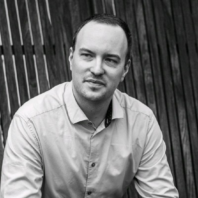

# Adrián Paníček

I'm a developer from Slovakia. You can usually find me somewhere between
software and electronics, writing code or figuring out how something works.

During the workday, my role at [Ciklum](https://www.ciklum.com/) is Expert
Embedded Software Engineer. Outside of that, plenty of projects happen
through my company, [Modus Operandi](CONTACTS.md). Most work these days
involves embedded systems, C++, and [Rust](https://rust-lang.org/), following
years of building backends for payments, invoicing, and banking.

Moving between those worlds keeps things interesting. Sometimes the problem
is in firmware, sometimes in the service talking to it, and sometimes it
means getting back to the electronics.

## Away from work

Work being my passion as well, free time often means going deeper into
software security, machine learning, or drone building. There is always
something to take apart, fix, put together, or rage quit trying.

Freelance projects range from automated answer-sheet evaluators to a
concrete 3D printer.

Not afraid of public speaking, I take part in smaller and larger events,
teaching people how to protect their privacy online or write better code.
Teaching and mentoring have been part of my work and free time for years.

Sometimes, something ends up on
[GitHub](https://github.com/adrianpanicek).

## Have a look around

The terminal works. Try `help`, browse the files, or open one in `vim`.
You can also just click the links.

- [Career](CAREER.md) — more about my work
- [Contacts](CONTACTS.md) — say hello
