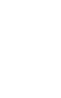
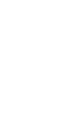

# Computers are just egg cups

Computers work in ones and zeros. This idea is so well known that it has even made its way into popular culture. But it's really hard for a non-technical person to imagine how a sequence of just two digits can represent images or sound.

Math tried to sell us `9 = 1*2^3 + 0*2^2 + 0*2^1 + 1*2^0`, but what does it actually mean? How do we make sense of numbers in computers if they use a different base from the one we're used to? Why binary, and why encode numbers this way?

In my experience, many young students struggle with the concept of binary and converting between decimal and binary. Back in the day, as a young gangster programmer, I read about a nice mnemonic technique somewhere that I'd like to share with you.

## A bit is an egg cup

Let's imagine an egg cup. One bit can be represented by either having an egg in the cup (1) or leaving it empty (0). With one egg cup, we can represent exactly two states: 1 or 0.

|  |  |
| :---: | :---: |
| 0 | 1 |

Now let's add another egg cup. Each of our two egg cups can be in one of two states, which gives us four combinations: 00, 01, 10, and 11.
We could assign a number to each combination like this:

```
Bits  Numbers
00 -> 45
01 -> 22
10 -> 18
11 -> 2
```

And voilà, we can represent four numbers. That mapping works if we agree on it, but we'd need to remember which combination means which number. For ordinary unsigned binary integers (whole numbers that aren't negative), we use a simple calculation instead.

We assign each cup a value. Let's give the right cup a value of 1 and the left cup a value of 2.

We then add up the values of the cups that contain an egg.

```
00 -> 0 in 2, 0 in 1 -> 0 + 0 -> 0
01 -> 0 in 2, 1 in 1 -> 0 + 1 -> 1
10 -> 1 in 2, 0 in 1 -> 2 + 0 -> 2
11 -> 1 in 2, 1 in 1 -> 2 + 1 -> 3
```

## Where the magic happens

Let's double the number of egg cups to four. This is where the magic happens: the number of combinations grows from 4 to 16. Each time we add a new cup on the left, we give it twice the value of the cup to its right.

|  |  |  |  |
| :---: | :---: | :---: | :---: |
| 8 | 4 | 2 | 1 |

This lets us represent every whole number in our range without gaps or duplicate representations: each cup's value is one more than the sum of all the cup values to its right.

If we now fill all of the egg cups, we get:

|  |  |  |  |
| :---: | :---: | :---: | :---: |
| 8 | 4 | 2 | 1 |

```
8 + 4 + 2 + 1 = 15
```

This means we can represent numbers from 0 to 15.

Try it yourself. Click a cup to add or remove an egg. The cups are worth 8, 4, 2, and 1 from left to right, and the number after the equals sign is their total.

```egg-cups
0101
```

> **Trivia:**
> A group of four bits (our egg cups) is called a _nibble_.

We can keep following the same pattern. With eight egg cups, we get:

```
128 64 32 16 8 4 2 1

128 + 64 + 32 + 16 + 8 + 4 + 2 + 1 = 255
```

A group of eight bits is called a **_byte_**. Our eight egg cups can represent whole numbers from 0 to 255. Of course, nothing stops us from going beyond one byte. Integers commonly use fixed sizes such as 8, 16, 32, or 64 bits; some representations can grow as needed, within the limits of available memory.

## Mnemonics

### Decimal to binary

To convert a number from decimal to binary, let's draw some cups. Let's say we want to convert the number _411_.

Starting on the right with 1, we work to the left, doubling the value each time. We stop when we reach a value greater than or equal to the number we're converting to binary.

```
512 256 128 64 32 16 8 4 2 1
```

Now let's go from left to right and find the largest cup value that doesn't exceed the number we're converting. Let's draw a circle (our egg) above it.

```
     o
512 256 128 64 32 16 8 4 2 1
```

Great! Now let's calculate the remainder:

```
     o
512 256 128 64 32 16 8 4 2 1

411 - 256 = 155
```

We keep the egg above 256 and repeat the process with our remainder of 155, using only the cups still empty, until the remainder is zero.

```
     o   o
512 256 128 64 32 16 8 4 2 1

411 - 256 = 155
155 - 128 = 27
```

```
     o   o        o
512 256 128 64 32 16 8 4 2 1

411 - 256 = 155
155 - 128 = 27
27 - 16 = 11
```

```
     o   o        o  o   o o
512 256 128 64 32 16 8 4 2 1

411 - 256 = 155
155 - 128 = 27
27 - 16 = 11
11 - 8 = 3
3 - 2 = 1
1 - 1 = 0
```

Now we read the cups from left to right, writing 0 for each empty cup and 1 for each cup with an egg.

```
     o   o        o  o   o o
512 256 128 64 32 16 8 4 2 1

0110011011
```

Just as in decimal, leading zeros don't change the value, so we can leave them out: `110011011`~2~ = `411`~10~.

### Binary to decimal

Going back is easier: there's no subtraction. Take a binary number such as `110011011` and imagine a row of egg cups, one for each digit. Put an egg in each cup marked 1 and leave each cup marked 0 empty. Starting at the right, label the cups 1, 2, 4, 8, and so on, doubling each time:

```
1   1   0  0  1  1 0 1 1
256 128 64 32 16 8 4 2 1
```

Then add up the values of the cups with eggs in them. Empty cups contribute nothing:

```
1   1   0  0  1  1 0 1 1
256 128 64 32 16 8 4 2 1

256 + 128 + 16 + 8 + 2 + 1 = 411
```

## Summary

That's the trick: the cups tell us the place values, and the eggs tell us which values to add. To turn a decimal number into binary, fill the cups; to turn it back, add up the values of the filled cups.

I hope this makes binary a little easier to picture. In future parts, we'll explore why computers use these two states, what else our rows of egg cups can represent, and how to arrange the eggs to represent negative numbers too.
